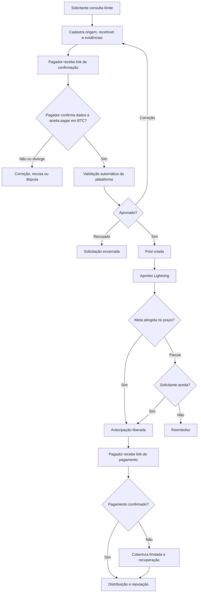

# Fluxos de usuário

## Fluxo principal

## Jornada da solicitante

1. Cria conta e recebe limite inicial de US$ 100.
2. Pode elevar o limite com identidade verificada, redes sociais conectadas por consentimento, histórico positivo e garantia.
3. Informa origem do pagamento, país do pagador, valor nominal, moeda estrangeira, vencimento e modalidade.
4. Envia documentos para armazenamento privado.
5. Acompanha confirmação e validação.
6. Se a pool fechar parcialmente, aceita valor menor ou determina reembolso integral.
7. Recebe a antecipação exclusivamente em BTC via Lightning e acompanha vencimento, cobertura e reputação.

Erros: limite insuficiente, documento inválido, pagador divergente, duplicidade, prazo impossível, cotação expirada e endereço/invoice inválido.

## Jornada da aportadora

1. Conecta carteira/identidade conforme necessário.
2. Consulta apenas pools aprovadas.
3. Visualiza valor nominal, antecipação, desconto, vencimento, modalidade, sinais de reputação, garantia/cobertura e riscos.
4. Escolhe valor e recebe invoice individual.
5. Paga e acompanha confirmação e participação proporcional.
6. Recebe distribuição ou reembolso.

A aportadora não vê documentos brutos, não confirma autenticidade e não aprova a pool.

## Jornada do pagador

1. Recebe link de confirmação com token expirável.
2. Confirma ou contesta serviço, valor e data e informa se aceita pagar em BTC.
3. Se não aceitar BTC, a solicitação é encerrada como inelegível e nenhuma pool é criada.
4. Próximo ao vencimento, recebe link de pagamento Lightning com moeda original de referência, cotação, valor em sats e validade.
5. Paga a invoice em BTC; a plataforma não recebe moeda fiat.
6. A pontualidade atualiza seu histórico; atraso ou inadimplência aciona lembretes, cobertura e recuperação.

## Jornada cambial

1. O recebível preserva moeda e valor originais do contrato.
2. A plataforma mostra a cotação usada, o valor bruto, cada tarifa, o spread e o valor líquido.
3. A modalidade determina como a obrigação da pool é exposta ou protegida; a antecipação da solicitante é sempre paga em BTC.
4. Taxas, spread e custos de recebimento são apresentados separadamente e reduzem somente o desembolso líquido da solicitante.
4. BRL é exibido apenas como referência local; payout fiat em BRL está fora deste projeto.
5. O pagador adquire BTC fora da plataforma e quita a invoice Lightning; nenhum USD/BRL entra no sistema.
6. Uma cotação expirada exige novo aceite quando alterar materialmente o valor líquido.

## Modalidade Full BTC

- A meta em moeda fiduciária é cotada em sats no fechamento/aceite do aporte.
- A antecipação é liberada em BTC.
- O pagador paga BTC via Lightning no vencimento.
- Como o recebível é referenciado em fiat, a quantidade distribuída em sats pode ser maior ou menor que a originalmente aportada.
- A tela deve mostrar que a aportadora assume essa variação.

## Modalidade pareada em dólar

- Cada aporte em sats é convertido para USDT assim que confirmado.
- A participação é registrada em USD/USDT.
- A obrigação das aportadoras permanece denominada/protegida em USD/USDT, mas a solicitante recebe BTC.
- A plataforma fornece BTC de sua tesouraria para o desembolso, sem consumir o USDT que protege a obrigação da pool.
- Na liquidação, o valor devido é calculado em USD e convertido para o ativo de saída previsto.
- Falha de swap impede o fechamento e nunca é ocultada como sucesso.

## Interrupções e retomada

- Formulário salvo como rascunho sem documentos públicos.
- Link de confirmação expirado pode ser reemitido e o anterior é invalidado.
- Invoice expirada gera nova intenção; pagamento tardio vai para conciliação.
- Webhook repetido não duplica aporte.
- Relay Nostr indisponível coloca evento em fila sem bloquear liquidação financeira.
- Falha após débito e antes do registro exige conciliação antes de nova tentativa.

## Disputa

Uma divergência pode ser aberta por pagador, solicitante, operação ou mecanismo antifraude. A pool fica bloqueada antes da liberação. Depois da liberação, a disputa não altera registros passados silenciosamente; cria eventos corretivos, aplica a política de cobertura e encaminha recuperação.
