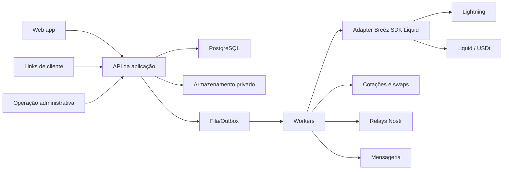

# Arquitetura recomendada

## Estado da decisão

Como o repositório está vazio e a stack não foi definida pela equipe, esta arquitetura é **ASSUMIDA PARA O MVP** e deve ser confirmada antes da implementação.

## Visão

## Stack proposta

- **Frontend e API:** Next.js com TypeScript, pela velocidade de entrega, rotas web e compartilhamento de tipos.
- **Persistência:** PostgreSQL, transações ACID e constraints para invariantes financeiros.
- **Acesso a dados:** ORM/migrations tipadas; escolha entre Drizzle e Prisma fica para a primeira etapa técnica.
- **Jobs:** worker separado com fila persistente ou padrão transactional outbox.
- **Documentos:** object storage compatível com S3, bucket privado e URLs temporárias.
- **Bitcoin, Lightning e USDt:** Breez SDK Liquid atrás de um adaptador próprio; BTC entra e sai por Lightning, enquanto o hedge da pool pareada usa exclusivamente USDt na Liquid.
- **Nostr:** NIP-01 com signer institucional externo (NIP-46 é uma opção de transporte); relays configuráveis e nenhuma chave da participante.

Um monólito modular é preferido no hackathon. Serviços financeiros externos são adaptadores, não microserviços internos prematuros.

## Módulos

1. Identidade e consentimento.
2. Limites, garantias e reputação.
3. Recebíveis, confirmação e validação.
4. Pools, aportes e participações.
5. Ledger, cotações, swaps e conciliação.
6. Liquidação, cobertura e recuperação.
7. Publicação Nostr.
8. Administração, auditoria e demonstração.

## Ledger

O saldo exibido nunca é calculado apenas a partir do estado da interface. Um ledger de partidas dobradas registra débitos e créditos por ativo, pool e participante. Movimentos externos possuem referência única, status e evento compensatório. A soma por ativo deve fechar em zero considerando contas de custódia, obrigações, custos e receita.

Cada recebível preserva a moeda estrangeira original. Conversões para BTC, USDT e BRL de referência são lançamentos separados; spread e tarifas nunca são incorporados silenciosamente à cotação.

A moeda estrangeira é somente referência contratual. Não existe conta fiat, integração bancária de cobrança ou saldo USD/BRL na plataforma: o cliente adquire BTC fora do sistema e paga uma invoice Lightning.

Na pool pareada em dólar, o ledger separa a obrigação protegida em USDT da liquidez BTC usada para pagar a solicitante. A plataforma precisa de uma conta de tesouraria BTC; não pode contabilizar o mesmo ativo simultaneamente como hedge e desembolso.

## Autenticação e autorização

- Participantes: LNURL-auth. A API gera `k1` aleatório e QR, a carteira assina com linking key específica de `auth.agendacryptoo.com`, o servidor verifica secp256k1 e emite sessão própria em cookie `HttpOnly`. O banco guarda apenas hashes de linking key, polling e sessão; endereço Lightning de recebimento é dado privado separado.
- Reputação Nostr: não autentica e não requer signer da participante. Um signer institucional externo publica atestados positivos pseudônimos por outbox; PostgreSQL permanece a fonte de autorização e risco.
- Cliente pagador: link tokenizado, hash armazenado, expiração, uso limitado e confirmação adicional para mudanças críticas.
- Administração: identidade separada, MFA, sessão curta e trilha de auditoria.
- Autorização no servidor por recurso e papel; esconder botão não constitui controle.

## Custódia

### MVP

Carteira controlada pela plataforma, com saldo real limitado, segregação lógica por pool, carteira quente mínima, backup, monitoramento, limites de saída e dupla aprovação. O banco registra obrigações; não inventa saldo sem conciliação com o nó.

### Evolução

Escrow/multisig com scripts Taproot e timelocks, removendo controle unilateral. A evolução exige desenho de recuperação, tratamento de múltiplos aportes, Lightning, Liquid e disputas.

## Validação da plataforma

Pipeline determinístico e versionado:

1. integridade e tipo dos documentos;
2. correspondência entre solicitação e confirmação;
3. identidade e consentimento;
4. duplicidade por hashes internos e atributos protegidos;
5. histórico da solicitante e do cliente;
6. limite e garantia;
7. regras de prazo, moeda e exposição;
8. decisão ou encaminhamento administrativo.

Nenhum modelo generativo decide sozinho aprovação, limite, inadimplência ou movimento de fundos.

## Erros e idempotência

- Chave idempotente por criação de invoice, webhook, swap, desembolso, reembolso e distribuição.
- Transactional outbox conecta mudanças no PostgreSQL a efeitos externos.
- Estados `pending` e `unknown` não são exibidos como sucesso.
- Retry com backoff apenas para operações comprovadamente idempotentes.
- Dead-letter queue e reconciliação manual para resultados desconhecidos.

## Observabilidade

Logs estruturados sem PII, correlation ID por operação, métricas de invoices, tempo de validação, falhas de swap, divergência do ledger e saldo da reserva. Alertas para saque anormal, exposição acima do limite e perda de sincronização. Auditoria não pode conter tokens, macaroons, preimages ou documentos.

## Ambientes

- Local: regtest/simuladores e dados fictícios.
- Preview: signet/testes, relays separados e nenhum segredo mainnet.
- Auth local: localhost permite testes de API/navegador, mas uma carteira em outro dispositivo só retorna para callback HTTPS público. O host LNURL-auth de produção não deve ser trocado depois do lançamento.
- Demo mainnet: feature flag, allowlist, limites mínimos e operação acompanhada.
- Produção: não existe até revisão jurídica, segurança, backup e testes de recuperação.

## Decisões adiáveis

- Provedor de cloud e object storage.
- ORM final.
- Provedor de mensagens.
- Estratégia completa de escrow.
- Originação por solicitantes fora do Brasil e payout fiat local.
- Motor estatístico de risco.

## Nostr Wallet Connect para o pagador

NWC usa adapter separado de LNURL-auth e do publisher de reputação. A API recebe a URI apenas em escrita, valida protocolo, pubkey, até três relays públicos `wss://`, secret e tamanho, consulta o evento NIP-47 `info` (`13194`) e exige `pay_invoice`. O secret é cifrado em AES-256-GCM com `NWC_CONNECTION_ENCRYPTION_KEY`; PostgreSQL guarda fingerprint SHA-256 separado.

O worker cria uma invoice idempotente por autorização e aplica data, valor máximo, tarifa, expiração, revogação e uso único antes de chamar `NwcGateway`. `SETTLED` publica exatamente um lançamento balanceado em BTC; falha definitiva mantém a invoice como fallback manual; `UNKNOWN` bloqueia retry. `RelayNwcGateway` existe atrás de `NWC_ENABLE_LIVE=true`; o fluxo financeiro e os testes atuais usam fake determinístico e não possuem scheduler real.
