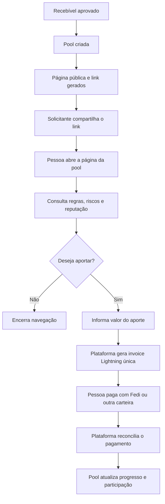
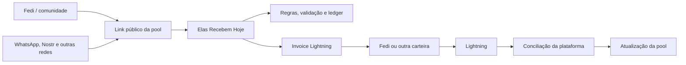

# Fedi, comunidade e compartilhamento de pools

## Estado da decisão

**Aprovada como documento de execução do MVP:** utilizar o Fedi como canal comunitário e carteira Lightning opcional, sem torná-lo responsável pela validação, custódia, ledger ou execução das regras financeiras das pools.

O Elas Recebem Hoje continua sendo a fonte de verdade para recebíveis, participantes, limites, validação, aportes, participações, liquidação, cobertura, reputação e auditoria.

O Fedi pode ser usado para descoberta, comunicação, mobilização comunitária e pagamento de invoices Lightning, da mesma forma que outras carteiras compatíveis.

Este documento define a Etapa 10 do `IMPLEMENTATION_PLAN.md`. Sua inclusão no plano não inicia a implementação, não habilita mainnet e não autoriza movimentação financeira.

## Objetivo

Permitir que uma solicitante compartilhe uma pool aprovada com sua própria rede e com comunidades de interesse, aumentando a quantidade de pessoas alcançadas e a possibilidade de fechar a pool mais rapidamente.

O produto não depende apenas de aportadoras que encontrem espontaneamente uma pool dentro do marketplace. A solicitante também pode mobilizar sua comunidade, contatos profissionais, redes sociais e grupos de Bitcoin para buscar a liquidez necessária.

## Tese de distribuição comunitária

Cada pool aprovada gera uma página pública compartilhável.

A solicitante pode divulgar essa página em:

- Fedi;
- WhatsApp;
- Nostr;
- LinkedIn;
- Telegram;
- comunidades de freelancers;
- comunidades Bitcoin;
- outros canais permitidos pela plataforma.

O compartilhamento não altera as regras de aprovação da pool. Somente recebíveis previamente confirmados pelo pagador e validados pela plataforma podem gerar páginas públicas de aporte.

A rede pessoal da solicitante ajuda na distribuição da oportunidade, mas não substitui a validação financeira, documental e antifraude realizada pelo Elas Recebem Hoje.

## Link compartilhável da pool

### Formato

Cada pool aprovada recebe um identificador público aleatório e uma URL própria, por exemplo:

`https://elasrecebemhoje.com/pool/{public_id}`

O identificador público não deve revelar:

- ID interno sequencial;
- nome completo da solicitante;
- CPF ou documento;
- nome completo ou contato do pagador;
- número de contrato;
- invoice Lightning;
- endereço de pagamento;
- dados comerciais sensíveis.

### Informações exibidas

A página pública pode apresentar:

- título e resumo da pool;
- origem do recebível, como salário, venda, comissão ou serviço;
- país do pagador;
- moeda e valor nominal de referência;
- valor da antecipação;
- modalidade da pool;
- data de vencimento;
- prazo restante para aportar;
- progresso da pool;
- quantidade de participantes;
- valor ainda necessário;
- desconto aplicado;
- custos apresentados separadamente;
- riscos da modalidade;
- cobertura disponível e seus limites;
- sinais resumidos de reputação;
- estado da pool;
- botão para aportar;
- botão para compartilhar.

A página não apresenta documentos brutos. Evidências são resumidas em sinais de validação, como “pagador confirmou”, “identidade verificada” ou “recebível aprovado pela plataforma”.

### Metadados de compartilhamento

A página deve possuir metadados próprios para compartilhamento social, com:

- título curto;
- descrição da pool;
- imagem segura e padronizada;
- percentual financiado;
- prazo restante;
- chamada para ação.

Nenhuma imagem ou descrição compartilhada pode revelar dados pessoais ou criar promessa de retorno garantido.

## Fluxo de compartilhamento

## Papel do Fedi

### Comunidade

O Elas Recebem Hoje pode manter uma comunidade no Fedi para:

- divulgar pools aprovadas;
- compartilhar atualizações de progresso;
- apresentar pools próximas da meta;
- explicar riscos e modalidades;
- educar sobre Bitcoin e Lightning;
- formar uma rede recorrente de aportadoras;
- permitir que participantes conversem e tirem dúvidas;
- fortalecer o caráter comunitário do produto.

A comunidade no Fedi funciona como canal de relacionamento e distribuição, não como fonte de autorização financeira.

### Carteira opcional

Uma aportadora pode usar o Fedi para pagar a invoice Lightning gerada pelo Elas Recebem Hoje.

O aporte também deve funcionar com outras carteiras Lightning compatíveis.

O produto não pode exigir que a pessoa:

- instale o Fedi;
- entre em uma federação específica;
- deposite previamente em uma federação;
- utilize e-cash;
- permaneça dentro de uma comunidade específica.

O Fedi é uma opção de acesso e pagamento, não um requisito para participar.

### Possível mini app futuro

Após o MVP, pode ser avaliada a criação de um mini app ou experiência integrada no Fedi para:

- consultar pools;
- acompanhar progresso;
- abrir a página pública;
- iniciar uma intenção de aporte;
- receber atualizações;
- visualizar reputação resumida.

Mesmo nesse cenário, validação, ledger, cálculo de participação, idempotência, estados e conciliação permanecem no backend do Elas Recebem Hoje.

## Arquitetura de integração

O Fedi não recebe permissão para alterar diretamente:

- estado do recebível;
- decisão de validação;
- limite da solicitante;
- meta da pool;
- participação das aportadoras;
- ledger;
- liquidação;
- cobertura;
- reputação interna.

Toda mudança financeira acontece no Elas Recebem Hoje após confirmação e conciliação do evento Lightning.

## Requisitos funcionais

### Compartilhamento

- **RF-SHARE-01:** gerar link público somente para pool aprovada e aberta.
- **RF-SHARE-02:** usar identificador público aleatório e não sequencial.
- **RF-SHARE-03:** permitir copiar e compartilhar o link por canais compatíveis.
- **RF-SHARE-04:** gerar metadados sociais sem dados pessoais ou comerciais sensíveis.
- **RF-SHARE-05:** exibir progresso, prazo, modalidade, riscos e valor ainda necessário.
- **RF-SHARE-06:** invalidar ou alterar a página pública quando a pool fechar, expirar, for cancelada ou entrar em disputa.
- **RF-SHARE-07:** impedir que pools em rascunho, validação, correção ou rejeitadas sejam compartilhadas como abertas para aporte.
- **RF-SHARE-08:** registrar origem de tráfego e canal de compartilhamento quando houver consentimento e parâmetros válidos.
- **RF-SHARE-09:** não expor documentos brutos, tokens de confirmação, invoices completas ou destinos Lightning.
- **RF-SHARE-10:** permitir que uma pessoa acesse a página sem possuir conta, exigindo autenticação apenas no momento necessário para concluir o aporte.

### Fedi

- **RF-FEDI-01:** aceitar pagamento de invoice por Fedi sem tratamento financeiro especial.
- **RF-FEDI-02:** manter compatibilidade com outras carteiras Lightning.
- **RF-FEDI-03:** permitir publicação de links de pools aprovadas em uma comunidade Fedi.
- **RF-FEDI-04:** deixar claro que mensagens e conteúdo comunitário não constituem validação financeira.
- **RF-FEDI-05:** não usar saldo, identidade comunitária ou participação no Fedi como prova automática de solvência.
- **RF-FEDI-06:** não depender da disponibilidade do Fedi para abrir, financiar, liquidar ou consultar uma pool.
- **RF-FEDI-07:** tratar integrações futuras com mini apps por adapter e feature flag.

## Requisitos de segurança e privacidade

- Links públicos devem usar IDs opacos.
- Tokens administrativos, de confirmação e de upload nunca aparecem na URL pública.
- Dados pessoais não entram em metadados sociais, analytics ou previews.
- A página pública deve limitar scraping abusivo e enumeração.
- A invoice é criada somente após uma intenção de aporte válida.
- Cada intenção possui valor, expiração, idempotency key e vínculo com uma única pool.
- O pagamento é reconhecido somente após conciliação.
- Mensagens publicadas no Fedi não podem ser consideradas evidência automática de pagamento ou validação.
- A plataforma deve alertar contra envio direto de BTC para pessoas em chats privados.
- O botão oficial de aporte sempre direciona para uma invoice criada pelo Elas Recebem Hoje.
- Administradores da comunidade Fedi não recebem acesso automático ao painel financeiro ou aos documentos.

## Riscos e mitigação

| Risco | Impacto | Mitigação |
|---|---:|---|
| Pool falsa compartilhada fora da plataforma | Alto | URL oficial, status verificável, IDs opacos e aviso contra pagamentos diretos |
| Exposição de dados da solicitante ou pagador | Alto | página pública mínima, metadados sanitizados e documentos privados |
| Promessa de retorno em mensagens comunitárias | Alto | linguagem padronizada, moderação e riscos visíveis antes do aporte |
| Dependência do Fedi | Médio | Fedi opcional e compatibilidade com qualquer carteira Lightning |
| Confusão entre comunidade e validação | Alto | deixar explícito que a plataforma valida e que a comunidade apenas divulga |
| Pagamento enviado por mensagem privada | Alto | invoices oficiais e alerta para nunca enviar a endereços informais |
| Manipulação social para pressionar aportes | Médio | termos, moderação, botão de denúncia e decisão de aporte individual |
| Compartilhamento de pool encerrada | Médio | página atualiza estado e bloqueia novas invoices |
| Tráfego artificial ou spam | Médio | rate limit, observabilidade e controles de publicação |
| Associação indevida entre identidade Fedi e reputação financeira | Médio | reputação permanece no ID interno opaco e usa regras próprias |

## Métricas

A funcionalidade pode acompanhar:

- quantidade de compartilhamentos por pool;
- acessos por canal;
- conversão de acesso para intenção de aporte;
- conversão de intenção para pagamento;
- tempo médio para completar a pool;
- percentual de liquidez originada pela rede da solicitante;
- quantidade de novas aportadoras trazidas por compartilhamento;
- recorrência das aportadoras;
- pools completadas após publicação na comunidade Fedi.

As métricas não devem publicar ou inferir gênero, saldo de carteira ou relações pessoais sem consentimento.

## Escopo do MVP

### Obrigatório

- botão “Compartilhar pool”;
- link público seguro;
- preview social padronizado;
- página pública com progresso e riscos;
- CTA para aportar;
- invoice Lightning pagável por qualquer carteira;
- exemplo de compartilhamento dentro de uma comunidade Fedi;
- rastreamento básico de origem do acesso;
- bloqueio automático quando a pool não estiver aberta.

### Opcional

- comunidade Fedi real;
- postagem automatizada de pools aprovadas;
- botão específico “Abrir no Fedi”;
- notificações de pool próxima da meta;
- ranking de canais de aquisição.

### Pós-hackathon

- mini app do Elas Recebem Hoje dentro do Fedi;
- integração mais profunda com notificações comunitárias;
- campanhas coletivas de liquidez;
- grupos temáticos por país ou categoria profissional;
- governança comunitária;
- estudo de uma federação própria para funções limitadas e não críticas.

## Fora do escopo

- tornar o Fedi obrigatório;
- transferir o ledger financeiro para o Fedi;
- usar e-cash como registro oficial de participação;
- permitir que guardiões aprovem recebíveis;
- usar administradores da comunidade como verificadores;
- considerar mensagens do chat como aceite jurídico;
- criar uma federação própria no MVP;
- substituir a conciliação Lightning da plataforma;
- custodiar todas as operações em uma federação sem desenho específico de governança, recuperação e auditoria.

## Ordem de execução

1. Modelar `public_id`, elegibilidade de publicação, estado público e origem de tráfego, com migration e testes partindo de banco vazio.
2. Implementar consulta pública sanitizada, impedindo enumeração e exposição de PII, tokens, documentos, invoices ou destinos Lightning.
3. Criar a página pública responsiva, metadados sociais e ações de copiar/compartilhar.
4. Integrar a intenção de aporte existente à página pública, exigindo autenticação somente no ponto necessário para concluir o aporte.
5. Garantir invoice única, expiração, idempotência, reserva de capacidade e atualização única após conciliação.
6. Adicionar rastreamento consentido e restrito a canal/origem, sem identidade pessoal ou saldo.
7. Validar pagamento com Fedi e ao menos outra carteira Lightning compatível, sem tratamento especial por carteira.
8. Ensaiar compartilhamento manual em uma comunidade Fedi e documentar indisponibilidade, moderação e alertas contra pagamentos por chat.

## Critérios de aceite

1. Uma pool aprovada gera uma URL pública não enumerável.
2. A URL não revela PII, documentos, tokens ou invoices completas.
3. A solicitante consegue copiar e compartilhar o link.
4. A página mostra progresso, prazo, modalidade e riscos atualizados.
5. Uma pessoa pode abrir o link a partir do Fedi e iniciar um aporte.
6. A invoice pode ser paga pelo Fedi ou por outra carteira Lightning.
7. Um pagamento confirmado atualiza a pool uma única vez.
8. Pool fechada, expirada ou cancelada não gera novas invoices.
9. Indisponibilidade do Fedi não interrompe o produto.
10. A interface deixa claro que o Fedi é comunidade e carteira opcional.
11. A validação e a escrituração continuam sob responsabilidade do Elas Recebem Hoje.
12. Nenhuma mensagem comunitária pode movimentar fundos ou mudar estados financeiros.

## Validações obrigatórias da etapa

- migration aplicada do zero e constraints testadas;
- testes unitários de elegibilidade, expiração, idempotência e sanitização;
- testes de integração da intenção de aporte e conciliação única;
- testes E2E em desktop e celular para página pública, compartilhamento e bloqueios de estado;
- inspeção dos metadados sociais e varredura de PII/segredos;
- teste de indisponibilidade do Fedi demonstrando que o produto continua operando;
- teste manual controlado com Fedi e outra carteira Lightning, respeitando os guardrails de mainnet já existentes.

## Mensagem de produto

> Cada pool aprovada pode ser compartilhada pela solicitante com sua rede e com comunidades Bitcoin. Isso amplia o alcance da operação e pode ajudar a fechar a antecipação mais rapidamente. O Fedi pode atuar como espaço comunitário e como uma das carteiras usadas para pagar o aporte, sem limitar a participação de quem utiliza outras carteiras Lightning.

## Consequência da decisão

A integração melhora a distribuição e reforça a proposta comunitária do Elas Recebem Hoje sem adicionar uma dependência obrigatória ou transferir responsabilidades financeiras para uma infraestrutura externa.

O produto preserva interoperabilidade, reduz fricção de entrada e mantém suas regras críticas em uma única fonte de verdade.
