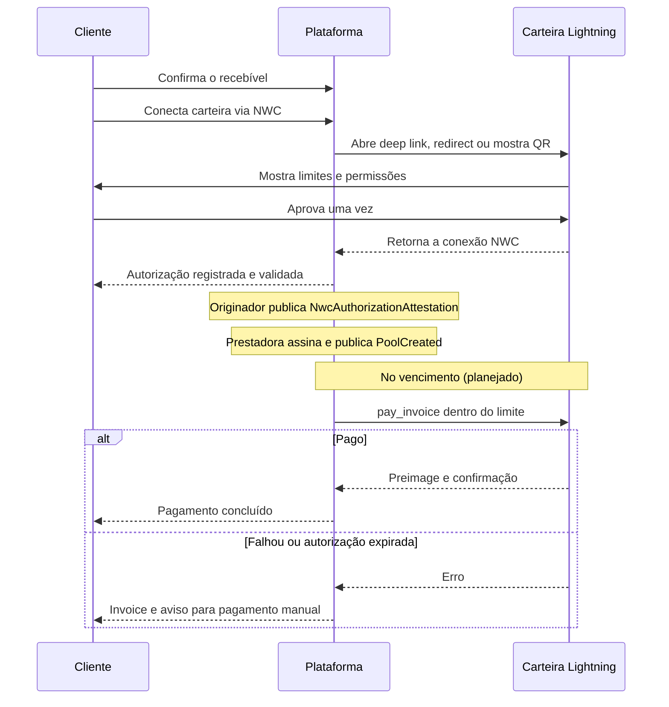

# Pagamento automático com NWC e conexão de um clique

> **Estado:** implementado (conexão NWC, vínculo ao recebível, validação de `pay_invoice`, armazenamento cifrado, revogação local, uso único, atestado público, `NwcAuthorizationAttestation` ativa como requisito do grafo para `PoolCreated` na versão `lrp/0.1.0`); controlado (`NWC_ENABLE_LIVE=false` — sem execução real de `pay_invoice`); planejado (scheduler de vencimento, cobrança automática real, retries, reconciliação, tratamento de pagamento desconhecido).
>
> Este documento descreve a plataforma **Elas Recebem Hoje**. O protocolo **LRP** é especificado em `docs/protocol/`.

## Estado da proposta

**Implementado no fluxo principal do MVP LRP. Na versão `lrp/0.1.0`, uma `NwcAuthorizationAttestation` ativa é requisito do grafo para a publicação de `PoolCreated`. A implementação de referência Elas Recebem Hoje aplica essa regra exigindo que o pagador autorize previamente o pagamento via NWC.**

A autorização NWC não deve ser descrita apenas como um requisito técnico: o pagador conecta sua carteira para autorizar previamente o pagamento do recebível no vencimento. Essa autorização fornece a garantia operacional necessária para que o originador publique o `NwcAuthorizationAttestation` e para que a prestadora possa publicar o `PoolCreated`. O caminho de pagamento manual não produz `NwcAuthorizationAttestation` e, portanto, na versão `lrp/0.1.0`, não libera `PoolCreated`.

A execução real de `pay_invoice` permanece **planejada**: no modo controlado atual (`NWC_ENABLE_LIVE=false`), nenhuma cobrança real é executada. A compatibilidade live com diferentes carteiras permanece experimental.

Este documento permanece como referência de UX e direção de produto para a conexão de um clique.

## Resumo executivo

A direção adotada usa **Nostr Wallet Connect (NWC)**:

1. O cliente confirma que o recebível existe.
2. Conecta sua carteira Lightning via NWC para autorizar previamente o pagamento no vencimento.
3. A plataforma abre uma carteira compatível ou apresenta um seletor de carteiras.
4. A própria carteira mostra exatamente o que será autorizado.
5. O cliente aprova uma única vez.
6. **Implementado:** a autorização NWC é validada, cifrada e publicada como `NwcAuthorizationAttestation` pelo originador. Na versão `lrp/0.1.0`, uma `NwcAuthorizationAttestation` ativa é requisito do grafo para a publicação de `PoolCreated`. A prestadora assina `PoolCreated` somente após essa publicação. O pagamento manual não produz `NwcAuthorizationAttestation` e, portanto, não libera `PoolCreated`.
7. **Planejado:** na data combinada, o scheduler deverá enviar à carteira um pedido NWC para pagar a invoice Lightning.
8. **Planejado:** se o pagamento automático falhar, o cliente receberá uma invoice para pagar manualmente.

A URI continua existindo tecnicamente, mas fica escondida no fluxo normal. Ela aparece somente em **Opções avançadas**, como compatibilidade para carteiras antigas.

**Importante:** conectar a carteira não movimenta fundos. A autorização é um compromisso prévio do pagador. A execução do pagamento depende do scheduler, que ainda não está conectado ao fluxo principal da aplicação.

Há uma restrição importante: **conectar a carteira em um clique não significa que qualquer carteira permitirá uma cobrança automática futura**. A carteira precisa suportar NWC, `pay_invoice` e uma autorização suficientemente limitada. A compatibilidade da carteira Evento ainda precisa ser confirmada; ela não aparece na lista pública de carteiras NWC consultada em julho de 2026.

## Duas ações diferentes

Hoje elas parecem uma só, mas devem ser explicadas separadamente:

### 1. Confirmar o recebível

O cliente assina uma confirmação de que aquele pagamento existe, com valor e data definidos. Essa ação não movimenta dinheiro.

### 2. Autorizar o pagamento automático

O cliente permite que a plataforma peça à carteira o pagamento de uma invoice Lightning no vencimento, dentro de limites explícitos. A carteira continua controlando os fundos até o pagamento.

Copy sugerida:

> **Confirme o pagamento e programe sua carteira**
>
> Primeiro, confirme que este recebível existe. Depois, conecte uma carteira compatível para autorizar o pagamento automático na data combinada. O dinheiro continua na sua carteira até o vencimento.

## Fluxo ideal para o cliente

### Tela 1 — Resumo do recebível

Mostrar somente:

- quem receberá;
- motivo do pagamento: salário, venda, comissão, serviço ou outro pagamento legítimo;
- valor na moeda do contrato;
- data de vencimento;
- regra de conversão para BTC;
- limite máximo que poderá ser solicitado;
- taxas máximas;
- botão **Confirmar recebível**.

### Tela 2 — Programar o pagamento

Após a confirmação:

- título: **Ative o pagamento automático**;
- explicação curta de que o dinheiro não será retirado agora;
- botão principal: **Conectar minha carteira**;
- link secundário: **Prefiro pagar manualmente no vencimento**;
- link discreto: **Opções avançadas**.

O botão principal abre um seletor apenas com carteiras compatíveis.

### Tela 3 — Autorização dentro da carteira

A carteira deve mostrar, antes da aprovação:

- nome e domínio da plataforma;
- permissão solicitada: somente `pay_invoice`;
- recebível ao qual a autorização pertence;
- valor máximo em sats;
- taxa máxima permitida;
- data inicial e expiração;
- uso único;
- opção de revogar a conexão.

A plataforma não deve solicitar saldo, histórico, criação de invoices ou outras permissões que não sejam necessárias.

### Tela 4 — Conclusão

Depois do retorno da carteira:

> **Pagamento programado**
>
> Sua carteira foi autorizada para este recebível. Nada foi pago agora. Tentaremos o pagamento em DD/MM/AAAA e avisaremos o resultado.

Mostrar também **Trocar carteira**, **Revogar autorização** e **Como funciona**.

## O comportamento muda conforme o dispositivo

### Celular com uma carteira compatível instalada

A plataforma usa um deep link NWC para abrir a carteira. Depois da aprovação, a carteira devolve o cliente ao site por callback. É o fluxo mais simples: botão, aprovação e retorno.

### Computador com a carteira no celular

O site exibe um **QR de conexão gerado pela plataforma**. O cliente abre a carteira e escaneia esse QR. A câmera usada é a da carteira, não a do nosso site.

Isso corrige o fluxo atual: o botão **Escanear QR** do site não deve abrir um seletor de fotos. No fluxo entre computador e celular, quem escaneia é a carteira.

### Carteira web

Uma carteira web pode usar uma conexão semelhante a OAuth: a plataforma redireciona o cliente, ele aprova no site da carteira e retorna pelo callback.

### Carteira sem conexão de um clique

Em **Opções avançadas**, manter:

- colar URI NWC;
- ler um QR existente usando câmera ao vivo;
- pagar manualmente no vencimento.

Upload de uma imagem de QR pode existir como último recurso, mas não deve ser a ação principal nem ser chamado de “escanear”.

## Como o pagamento futuro acontece

> **Estado:** a conexão e a autorização NWC estão implementadas. A execução de `pay_invoice` no vencimento está planejada e depende do scheduler.

NWC não retira o dinheiro no momento da conexão. A autorização é registrada, validada e publicada como atestado público. No vencimento, o scheduler planejado deverá criar ou obter a invoice correta e enviar um pedido `pay_invoice`, criptografado pelo protocolo, à carteira conectada. No modo controlado atual (`NWC_ENABLE_LIVE=false`), nenhuma dessas etapas executa pagamentos reais.

## O problema mais importante: o valor em sats ainda não é conhecido

O recebível pode ser denominado em dólar, mas pago em BTC no vencimento. Portanto, quando o cliente conecta a carteira, ainda não sabemos quantos sats representarão o valor exato naquele dia.

Não devemos resolver isso pedindo autorização ilimitada.

### Proposta para o MVP

O cliente autoriza um **teto máximo em sats**, exibido também como estimativa em dólar, composto por:

1. valor convertido na cotação de referência do momento;
2. margem de oscilação previamente definida e visível;
3. teto de taxa Lightning separado e visível.

No vencimento, a plataforma só poderá pedir o menor valor entre:

- o valor efetivamente devido segundo a regra de cotação; e
- o teto autorizado.

Se o teto não for suficiente porque o BTC caiu muito, o sistema não cobra parcialmente de forma silenciosa. Ele solicita uma nova aprovação ou oferece pagamento manual.

### Alternativas que também podemos discutir

- **Fixar o valor em sats na confirmação:** torna a automação previsível, mas transfere a variação cambial para uma das partes.
- **Pedir aprovação final perto do vencimento:** mantém o valor exato, mas deixa de ser totalmente automático.
- **Autorizar um teto com margem:** melhor equilíbrio para o MVP, desde que a margem seja clara e limitada.
- **Limite denominado em moeda fiduciária na carteira:** seria ideal, mas não faz parte do NWC padrão e não pode ser presumido entre carteiras.

## Contrato mínimo da autorização

> **Estado:** implementado no código e aplicado pela plataforma.

Cada autorização pertence a um único recebível e contém:

| Controle | Regra | Estado |
|---|---|---|
| Permissão | Somente `pay_invoice` | Implementado |
| Uso | Uma cobrança bem-sucedida (uso único) | Implementado |
| Valor | Teto máximo em sats (`maxAmountMsat`) | Implementado |
| Taxa | Teto separado em sats (`maxFeeMsat`) | Implementado |
| Janela | Próxima ao vencimento (`scheduledFor`) | Implementado |
| Expiração | Pouco depois do vencimento (`expiresAt`) | Implementado |
| Repetição | Idempotência por recebível | Implementado |
| Revogação local na plataforma | Disponível ao cliente; marca a autorização e a conexão como REVOKED no banco, mas não revoga automaticamente a permissão remota na carteira | Implementado |
| Dados | Sem acesso ao saldo ou histórico | Implementado |
| Armazenamento cifrado | AES-256-GCM com chave de 32 bytes | Implementado |
| Atestado público | `NwcAuthorizationAttestation` com fingerprint segura | Implementado |
| Execução real de `pay_invoice` no vencimento | Via scheduler | Planejado |

## O que pode falhar

> **Estado:** o tratamento de falhas no vencimento está planejado; o worker existe mas usa gateways simulados.

Pagamento programado não pode ser prometido como garantia. No vencimento, a carteira pode estar:

- sem saldo;
- desconectada ou offline;
- com a autorização revogada ou expirada;
- sem orçamento suficiente;
- sem rota Lightning adequada;
- incompatível com a operação solicitada.

Por isso o produto precisa de (planejado):

1. scheduler que identifica o vencimento e dispara tentativas idempotentes e limitadas;
2. aviso imediato ao cliente;
3. invoice manual como fallback;
4. estado visível para a recebedora e para a administração;
5. trilha de auditoria sem armazenar seeds, `nsec` ou dados desnecessários da carteira.

## Alternativas comparadas

| Opção | Experiência | Compatibilidade | Trabalho | Avaliação |
|---|---|---:|---:|---|
| Copiar e colar URI NWC | Ruim | Boa em carteiras NWC antigas | Baixo | Apenas fallback |
| Deep link NIP-47 com callback | Excelente no celular | Depende da carteira | Médio | Recomendado |
| Conexão web semelhante a OAuth | Excelente para carteira web | Depende do provedor | Médio | Recomendado quando disponível |
| QR gerado pelo site e lido pela carteira | Boa entre computador e celular | Boa entre carteiras NWC compatíveis | Médio | Recomendado |
| Bitcoin Connect | Boa interface pronta para web/Next.js | Depende dos conectores suportados | Baixo a médio | Melhor caminho para protótipo |
| Integração NWC própria | Máximo controle | Definida por nós | Alto | Evolução posterior |
| Carteira custodial embutida | Muito simples | Controlada pela plataforma | Alto risco e custódia | Fora da estratégia atual |

## Recomendação de implementação

### Para o hackathon — implementado

1. **Implementado:** conexão NWC com validação de `pay_invoice`, limite, validade, revogação local na plataforma e uso único.
2. **Implementado:** armazenamento cifrado da conexão (AES-256-GCM).
3. **Implementado:** publicação do `NwcAuthorizationAttestation` pelo originador.
4. **Implementado:** `NwcAuthorizationAttestation` ativa como requisito do grafo para `PoolCreated` na versão `lrp/0.1.0`.
5. **Implementado:** modo controlado com `NWC_ENABLE_LIVE=false` (gateway fake).

### Para o hackathon — pendente

6. Integrar **Bitcoin Connect** ou componente equivalente para conexão de um clique.
7. Mostrar **Conectar minha carteira** como ação principal.
8. Oferecer deep link/callback quando a carteira suportar.
9. Mostrar QR de pareamento no computador para leitura pela carteira no celular.
10. Esconder a URI em **Opções avançadas**.
11. Não anunciar compatibilidade com carteiras antes de testar.

### Depois do hackathon

1. Criar adaptadores próprios para os diferentes métodos de conexão.
2. Consultar capacidades da carteira antes de oferecer automação.
3. Implementar um registro de compatibilidade por carteira e versão.
4. Adicionar monitoramento, revogação e renovação das autorizações.
5. Fazer revisão de segurança do armazenamento da credencial NWC e do executor agendado.

## Mudança proposta para a tela atual

Remover da experiência principal:

- “Conectar com Nostr Wallet Connect” como título técnico;
- seletor “Exemplo de carteira”;
- campo grande para URI;
- botão que chama upload de imagem de “escanear”.

Substituir por:

> **Programe o pagamento deste recebível**
>
> Conecte uma carteira Lightning compatível. Você aprovará o valor máximo e a data dentro da própria carteira. Nada será cobrado agora.

Botões:

- **Conectar minha carteira**;
- **Pagar manualmente no vencimento**;
- **Opções avançadas**.

## Decisões que precisamos tomar juntas

1. O pagamento automático será obrigatório ou o cliente poderá escolher o pagamento manual?
2. Podemos oferecer automação apenas para uma lista de carteiras compatíveis no MVP?
3. Qual margem máxima de oscilação do BTC poderá entrar no teto autorizado?
4. Se o teto ficar insuficiente, preferimos nova aprovação ou pagamento manual?
5. Quantos dias antes e depois do vencimento a autorização poderá ser usada?
6. A conexão deve ser automaticamente revogada depois do pagamento?
7. Para a demo, começamos com Alby Hub/Alby Go e tratamos a Evento como compatibilidade a validar?

## Leituras recomendadas

- [NIP-47 — especificação do Nostr Wallet Connect](https://github.com/nostr-protocol/nips/blob/master/47.md)
- [NIP-47 — seção de deep links](https://nips.nostr.com/47#nwc-deep-links)
- [NWC: conexões de carteira com um clique](https://docs.nwc.dev/bitcoin-apps-and-websites/connecting-to-the-wallet/1-click-wallet-connections)
- [NWC: SDKs e ferramentas, incluindo Bitcoin Connect](https://docs.nwc.dev/bitcoin-apps-and-websites/sdks-and-tools)
- [Alby Hub: conexões de aplicativos e limites](https://guides.getalby.com/user-guide/alby-hub/app-connections)
- [Visão geral e carteiras publicamente listadas no ecossistema NWC](https://nwc.dev/)

## Conclusão

É possível tornar o pagamento automático muito mais simples sem transformar a plataforma em custodiante: a conexão NWC pode acontecer por botão, deep link, redirect ou QR de pareamento, e o dinheiro permanece na carteira do cliente até o vencimento.

O ponto que exige decisão de produto não é a URI. É **como autorizar com segurança um valor futuro em sats quando o contrato está denominado em dólar**. Para o MVP, a proposta mais equilibrada é um teto transparente em sats, uma margem limitada, uso único e fallback manual.
